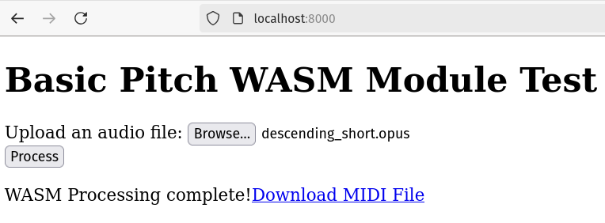

# basicpitch.cpp

C++20 inference for the [Spotify basic-pitch](https://github.com/spotify/basic-pitch) automatic music transcription/MIDI generator neural network with ONNXRuntime, Eigen, and libremidi. Demo apps are provided for WebAssembly/Emscripten and a cli app.

I use [ONNXRuntime](https://github.com/microsoft/onnxruntime) and scripts from the excellent [ort-builder](https://github.com/olilarkin/ort-builder) project to implement the neural network inference like so:
* Convert the ONNX model to ORT (onnxruntime)
* Include only the operations and types needed for the specific neural network, cutting down code size
* Compile the model weights to a .c and .h file to include it in the built binaries

After the neural network inference, I use [libremidi](https://github.com/celtera/libremidi) to replicate the end-to-end MIDI file creation of the real basic-pitch project. I didn't run any official measurements but the WASM demo site is **much faster** than Spotify's own [web demo](https://basicpitch.spotify.com/).

## Project design

* [ort-model](./ort-model) contains the model in ONNX form, ORT form, and the generated h and c file
* [scripts](./scripts) contain the ORT model build scripts
* [src](./src) is the shared inference and MIDI creation code
* [src_wasm](./src_wasm) is the main WASM function, used in the web demo
* [src_cli](./src_cli) is a Linux cli app (for debugging purposes) that uses [libnyquist](https://github.com/ddiakopoulos/libnyquist) to load the audio files
* [vendor](./vendor) contains third-party/vendored libraries
* [web](./web) contains basic HTML/Javascript code to host the WASM demo

## Usage

I recommend the tool `midicsv` for inspecting MIDI events in CSV format without more complicated MIDI software, to compare the files output by basicpitch.cpp to the real basic-pitch.

### Python

To run Spotify's own inference code and the original Python inference code with ONNX, use the included inference script:
```
$ python scripts/python_inference.py --dest-dir ./midi-out-python/ ~/Downloads/clip.wav
...
Using model: /home/sevagh/repos/basicpitch.cpp/ort-model/model.onnx
Writing MIDI outputs to ./midi-out-python/

Predicting MIDI for /home/sevagh/Downloads/clip.wav...
...
```

### CLI app

After following the build instructions below:
```
$ ./build/build-cli/basicpitch ~/Downloads/clip.wav ./midi-out-cpp
basicpitch.cpp Main driver program
Predicting MIDI for: /home/sevagh/Downloads/clip.wav
Input samples: 441000
Length in seconds: 10
Number of channels: 2
Resampling from 44100 Hz to 22050 Hz
output_to_notes_polyphonic
note_events_to_midi
Before iterating over note events
After iterating over note events
Now creating instrument track
done!
MIDI data size: 889
Wrote MIDI file to: "./midi-out-cpp/clip.mid"
```

### WebAssembly/web demo

For web testing, serve the web static contents with the Python HTTP server:
```
$ cd web && python -m http.server 8000
```

Use the website: 



## Build instructions

(Only tested on Linux, Pop!\_OS 22.04). I'm assuming you have a typical C/C++ toolchain e.g. make, cmake, gcc/g++, for your OS. You also need to set up the [Emscripten SDK](https://github.com/emscripten-core/emsdk) for compiling to WebAssembly.

Clone the repo with submodules: 
```
$ git clone --recurse-submodules https://github.com/sevagh/demucs.cpp
```

Create a Python venv (or conda env) and install the requirements:
```
$ pip install -r ./scripts/requirements.txt
```

Activate your venv and run the ONNXRuntime builder scripts:
```
$ activate my-env
$ ./scripts/build-ort-linux.sh
$ ./scripts/build-ort-wasm.sh
```

Check the outputs:
```
$ ls build/build-ort-*/MinSizeRel/libonnx.a
build/build-ort-linux/MinSizeRel/libonnx.a  build/build-ort-wasm/MinSizeRel/libonnx.a
```

**Optional:** if you want to re-convert the ONNX model to ORT in the ort-model directory, use `scripts/convert-model-to-ort.sh ./ort-models/model.onnx`. The ONNX model is copied from `./vendor/basic-pitch/basic_pitch/saved_models/icassp_2022/nmp.onnx`

Build cli app:
```
$ make cli
$ ls build/build-cli/basicpitch
build/build-cli/basicpitch
```

For WebAssembly, first, set up the [Emscripten SDK](https://github.com/emscripten-core/emsdk). Then, build the WASM app with your EMSDK env script:
```
$ export EMSDK_ENV_PATH=/path/to/emsdk/emsdk_env.sh
$ make wasm
$ ls build/build-wasm/basicpitch.wasm
build/build-wasm/basicpitch.wasm
```

This also copies the updated `basicpitch.{wasm,js}` to the `./web` directory.
